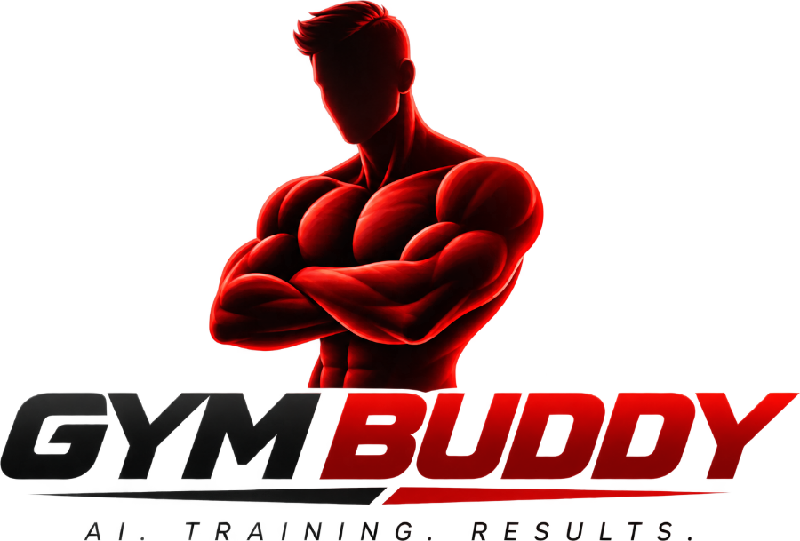

<picture>
  <source media="(prefers-color-scheme: dark)" srcset="logo/gymbuddy-hero-dark.png">
  
</picture>

# GymBuddy

A coaching platform built on [openGym](https://gitea.com/DuarteSantos/openGym) — the gym and
body-weight tracker, extended with coach ↔ client programming, delivered as a web app, an iOS app
and an Android app from one codebase.

**AGPL-3.0-or-later.** Source stays public; see [NOTICE.md](NOTICE.md) for the upstream
attribution and the App Store additional permission we inherit.

## Run it

```bash
cp .env.example .env
docker compose up -d --build
```

Open **http://localhost:8080**. With `SEED_DEMO=1` in `.env` (the default in the example) the
first boot creates a coach and three clients with twelve weeks of training each:

| Account | Password | What it shows |
|---|---|---|
| `coach@gymbuddy.test` | `gymbuddy-demo-1` | The roster: adherence, who has drifted, an open proposal |
| `sam@gymbuddy.test` | `gymbuddy-demo-1` | Shares everything; has a proposal waiting |
| `ava@gymbuddy.test` | `gymbuddy-demo-1` | Shares programmes and workouts, not body weight |
| `theo@gymbuddy.test` | `gymbuddy-demo-1` | Shares programmes only, and stopped training three weeks ago |

Turn `SEED_DEMO` off for a real instance and set a real `SESSION_SECRET`. For a real deployment —
HTTPS, passkeys on a domain you own, backups, invite-only signup — see
[docs/SELF_HOSTING.md](docs/SELF_HOSTING.md).

## Layout

```
apps/client       React 19 + Vite PWA, wrapped by Capacitor 7 for iOS and Android
apps/api          Fastify — auth, delta sync, coaching
apps/site         marketing site (static)
packages/domain   runtime-agnostic training logic, shared by client and server
packages/db       Postgres schema, migrations, sync engine, coaching rules
packages/ai       the language layer, and the deterministic path underneath it
infra             nginx, Docker builds, media fetch, smoke and browser tests
docs              self-hosting, mobile builds, releasing, store listings, upstream README
```

### How sync works

openGym stored a user's entire account as one JSON blob and synced it with a whole-state `PUT`,
last write wins. That is elegant for one person on their own server and fatal for coaching: a
coach editing a programme while their client is mid-session silently destroys one of the two
edits, and the server can never answer a question about data it never parses.

GymBuddy stores rows. Every write bumps a per-user counter and records what changed at that
value; a client remembers the last counter it saw and asks for what came after. The client still
holds the blob in memory — that part was never the problem, and it is what keeps the app working
offline — but the wire format and the database are relational.

`packages/domain/src/statemap.js` is the boundary between the two, imported by both sides so
there is one mapper rather than two that drift.

### What the AI layer is, and is not

The domain owns every number. Sets, reps, loads, progression policies and exercise selection are
computed by `packages/domain/src/planner.js` against the real library and the same progression
rules the app already runs on. A model is asked to do two things: turn free text into a structured
brief, and write the note explaining a change. Both have deterministic implementations underneath.

Which model does that is configuration. DeepSeek, Anthropic and anything else speaking the
OpenAI shape are one adapter; a model on your own hardware via Ollama is the failover underneath
them, which is what an outage, a lapsed key and a blocked route all look like from here. Two
tiers, because the note a client actually reads is worth a better model than the parse nobody
sees. See `.env.example`.

With no key set at all, GymBuddy builds the same plans, finds the same stalls and parses the
same logs — it phrases things from a template instead of writing prose, in whichever language
the person is using, and `/api/ai/status` says so. That is what makes it safe to expose: nothing
can invent a lift that is not in the library, or put 140 kg on a beginner's bar.

Nothing drafted is ever applied. A generated plan comes back for the person to look at; a drafted
change for a client fills in the composer their coach already uses. There is no endpoint that
writes training.

### What is paid for, and what never is

Training is free and stays free: logging, programmes, history, stats — everything openGym did,
ungated. The subscription is on the **coach** side, and it buys three things: taking on clients,
proposing programmes to them, and messaging them. Reading a roster you already built is never
gated, and **a client is never gated at all** — they are not the customer, and a coach whose
payment lapses cannot take their clients' training away. It was never the coach's to take.

With no `ZARINPAL_MERCHANT_ID` set, none of that applies and coaching is simply free. The paid
tier is a property of a deployment, not of the software, which is also the only honest reading
of the licence — we can charge for hosting, not for the code.

Zarinpal has neither recurring billing nor webhooks, so a subscription is a **paid-through
date** that a purchase extends rather than a state machine something upstream drives. Payments
are confirmed when the payer's browser comes back; the ones that never come back are found by
reconciliation, not by hoping.

### The rule that makes coaching safe

**A coach never writes a client's rows.** A proposed programme lands in `routine_revisions` and
becomes real only when the client accepts it, at which point it is written as the client's own
row through the normal sync path. There is only ever one writer per row, so there is nothing to
merge — and a client's own edit cannot be erased by a coach's sync.

Scopes are the other half: sharing a programme does not share what you weigh. Every coach-side
read is gated on the scope the client granted, section by section.

## Develop

```bash
npm install
npm run db:reset          # schema + exercise library, against $DATABASE_URL
npm run db:demo           # …plus the demo coach and clients
npm run api               # API on :3000
npm run dev               # client on :5173, proxying /api to it
npm test                  # domain, database, API, client and release suites
npm run test:smoke        # end-to-end over HTTP against a running instance
npm run test:e2e          # the same flows driven through a real browser
npm run sync:mobile       # build + capacitor sync for the native shells
npm run version:stamp     # one version, into all four files that carry it
```

The database and API suites need a Postgres in `DATABASE_URL`. CI stands one up; locally, any
throwaway database will do.

## Three products, one codebase

The web app is the whole thing: accounts, sync, coaching, subscriptions. The **native builds**
(`VITE_MOBILE=1`) are a different product on purpose — an offline single-user tracker with no
accounts, no backend and nothing to buy. Training data lives in a file on the phone, and
`api()` throws if anything tries to reach a server, so the privacy declaration the app stores
are given is enforced rather than promised.

That split is also the answer to the store question: a build with no accounts and no payment
surface raises none of the rules about who may take money for digital goods. Coaching is a web
product, reached through the PWA. See [docs/RELEASING.md](docs/RELEASING.md) — including why
the App Store and Google Play are not available on this path at all, and which channels are.

## Status

- [x] **Phase 1** — fork, rebrand, monorepo, domain package extracted
- [x] **Phase 2** — Postgres, delta sync, Fastify API, migration from an openGym blob
- [x] **Phase 3** — coaches, clients, scopes, proposals, messaging
- [x] **Phase 4** — programme generation, training review, logging by typing
- [x] **Phase 5** — Persian and RTL, locale-aware weeks, rate limits, provider choice
- [x] **Phase 6** — subscriptions end to end; release engineering and store metadata
- [x] **Phase 7** — the visual identity, every icon cut from one vector and checked in CI
- [ ] **Launch** — exercise media licence, legal review, a public repository

See [CHANGELOG.md](CHANGELOG.md) for what all of that actually amounts to, and for the
known gaps — the exercise media is not licensed for a paid deployment, and there is no
public repository yet.

## Before launch

Two things block a paid launch and neither is code:

1. **Exercise media.** The 1,324 animations are © [Gym visual](https://gymvisual.com/), not MIT.
   The dataset grants us nothing — obtain a commercial licence or replace the media. Exercise
   rows carry `image_url` and `animation_url`, so swapping the source is an `UPDATE`.
2. **Legal review** of the AGPL position, since we charge for hosting.
