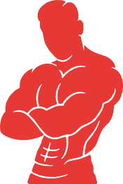

# GymBuddy — the mark



The figure, arms crossed, drawn as a single silhouette with the muscle contours cut out of it
as negative space. On a red field it is white and the contours read as red lines; on paper it
is red and the contours read as white. One shape, two colourways, no second artwork.

It is a vector, traced from the app-icon artwork in this directory — not an upscaled render.
The contours hold at 512 and at 1024, and close up into a solid silhouette somewhere below
32px, which is the size at which every figure mark stops being a figure.

## Files

Everything the apps ship is cut from these. Edit the SVG, never the PNG.

| File | What it is | Where it goes |
|---|---|---|
| `gymbuddy-icon.svg` | Rounded red field, white figure | Web favicon, PWA, Android legacy launcher |
| `gymbuddy-icon-square.svg` | Square red field, white figure | iOS and Android, which apply their own mask |
| `gymbuddy-icon-maskable.svg` | Figure pulled in to the safe circle | `purpose: maskable`, Android adaptive |
| `gymbuddy-mark.svg` | Figure alone, GymBuddy red, transparent | Paper, light UI, README, print |
| `gymbuddy-mark-white.svg` | Figure alone, white, transparent | On red, on ink, adaptive foreground layer |
| `gymbuddy-mark-black.svg` | Figure alone, off black, transparent | One-colour use on light surfaces |
| `gymbuddy-wordmark.svg` | `GYM BUDDY` + tagline, off black and red | Light surfaces |
| `gymbuddy-wordmark-white.svg` | Same, off black turned white | Dark surfaces |
| `gymbuddy-lockup.svg` | Figure above the wordmark | The full logo, light surfaces |
| `gymbuddy-lockup-white.svg` | Same, for dark surfaces | The full logo, dark surfaces |
| `gymbuddy-hero.png` | The lockup as a shaded render, 900px | README header, marketing |
| `gymbuddy-hero-dark.png` | Same, wordmark lifted for dark pages | README header on a dark theme |

The mark files are trimmed to the figure — no invisible padding — so they scale predictably
wherever they are dropped. The icon files are 512×512 with the figure at 83% of the height,
which is the proportion the app-icon artwork uses.

Regenerate every raster after touching any of them:

```bash
node infra/scripts/render-logo.mjs
```

That writes `apps/client/public/`, the Android mipmaps, both platforms' splash screens and the
iOS app icon, and copies the vectors to `apps/client/public/icon.svg` and
`apps/client/resources/icon.svg`. CI runs the same script with `--check` and fails a build
where a committed PNG has drifted from its source.

**The launch screen** is not a separate drawing: it is `gymbuddy-icon.svg` centred on off
black, at 26% of the shorter side — 14% on the single square iOS uses for every device, where
cropping to a tall phone throws away more than half the width. That rule lives in the render
script. `gymbuddy-lockup.svg` could go there instead now that it exists, but the tile is what
the brand system's own onboarding screens show.

## Colour

| | Hex | |
|---|---|---|
| GymBuddy red | `#E63935` | Pantone 185 C · RGB 230 57 53 · CMYK 0 87 77 10 |
| Off black | `#0D0D0D` | Pantone Neutral Black C |
| Pure black | `#000000` | |
| White | `#FFFFFF` | |

The icon field is a vertical gradient, `#E63935` down to `#9E1512`. Everywhere else the red is
flat — the gradient belongs to the icon, not to the mark.

## Using it

- **On the red field the figure is white**, never red on red. On ink, white. On paper, red or
  off black — the contour lines are whatever is behind the figure, so the mark needs a plain
  surface to sit on. It does not go over photography.
- **Clear space** on every side is the width of the head. Nothing crosses it.
- **Smallest size** is 24px for the figure alone, 32px inside a field. Below that the contours
  fill in and it becomes a silhouette; that is expected, and it still reads.
- Do not recolour the contours, add a stroke, rotate, skew, or drop a shadow on it. Do not put
  the rounded field behind it anywhere except an app icon — the field is the icon, not the logo.

## The wordmark

`BUDDY` is red in every colourway. Only `GYM` and the tagline change — off black on light
surfaces, white on dark — because the red half is the brand colour and does not become
something else on a different background.

The lockup places the figure above the wordmark at the proportions the brand system uses:
the figure is 0.372 of the wordmark's width, and the gap under it is 0.0438 of its own
height. Those are measured off the system's own stacked lockup, not chosen.

**Smallest size** for the wordmark is about 360px wide. Below that the tagline closes up and
stops being readable while the letters are still fine — at which point drop the tagline
rather than shrinking it further. There is no tagline-free cut in here yet; it is four lines
to add if a navigation bar needs one.

The two-line **horizontal** variant in the brand sheets — figure left, `GYM` over `BUDDY`
right, tagline beneath both — is not here. It is a different arrangement of the letters
rather than a recolouring of this one, so it would have to be laid out from the glyphs
again rather than composed from what exists.

## Provenance, and what is still raster

The brand system in this directory is the source of everything above:

- The figure was traced from the **APP ICON SYSTEM** sheet (`…10_28_06 PM.png`), which carries
  the largest flat rendition of the mark.
- The palette is read off the **COLOR SYSTEM** sheet (`…10_29_05 PM.png`), not sampled by eye.
- Type, bilingual FA/EN pairing and the screen system are in the remaining sheets.
- The wordmark was traced from the hero render (`…10_26_56 PM.png`), which carries it at 144px
  cap height. That file is already on transparency, so the letterforms come off its alpha
  channel and the shading inside them is irrelevant; chroma then says which half of the
  wordmark each shape belongs to. The tagline is masked by band rather than by colour — it is
  one colour by design, but it sits over the render's red glow, and two of its glyphs file as
  red if you go by chroma alone.

**The hero is still raster.** `gymbuddy-hero-*.png` are the same lockup as a shaded
illustration — gradients, highlights, a rim light — which is a painting rather than a logo and
does not reduce to flat paths. They are that render trimmed to its content and scaled to
900px. For anything that needs the lockup crisp at any size, use `gymbuddy-lockup.svg`.

`gymbuddy-hero-dark.png` differs from the light one in the wordmark only. `GYM` and the
tagline are black, which disappears on a dark page, so their ink is inverted to white — the
figure is untouched, because its shading is neutral black as well and inverting that punches
holes in the torso. The README picks between them with `prefers-color-scheme`.

The README header still uses the hero, because the illustration is what belongs at the top of
a page someone lands on. The vector lockup is the one to reach for everywhere else.
