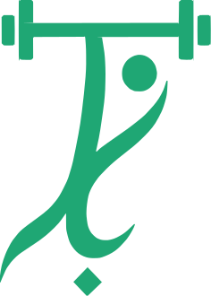

# GYMYAR — the mark



A Persian calligraphic stroke that doubles as a lifter under a barbell: the bar and plates
across the top, the figure's head and raised arm inside the curve, and a diamond resting at
the foot of the descender. One continuous gesture — strength held still at the top, motion
in the tail.

It is a vector, traced from the brand system's own artwork sheets — not an upscaled render.
It is drawn as filled contours with `fill-rule="evenodd"`, so the counters stay open at any
size, and it closes into a solid silhouette somewhere below 20px.

## Files

Everything the apps ship is cut from these. Edit the SVG, never the PNG.

| File | What it is | Where it goes |
|---|---|---|
| `gymyar-icon.svg` | Rounded ivory field, emerald mark | Web favicon, PWA, Android legacy launcher |
| `gymyar-icon-square.svg` | Square ivory field, emerald mark | iOS and Android, which apply their own mask |
| `gymyar-icon-maskable.svg` | Mark pulled in to the safe circle | `purpose: maskable`, Android adaptive |
| `gymyar-mark.svg` | Mark alone, brand emerald, transparent | Paper, light UI, README, print |
| `gymyar-mark-white.svg` | Mark alone, ivory, transparent | On emerald, on onyx, adaptive foreground layer |
| `gymyar-mark-black.svg` | Mark alone, onyx, transparent | One-colour use on light surfaces |
| `gymyar-wordmark.svg` | `GYMYAR` + tagline, emerald and onyx | Light surfaces |
| `gymyar-wordmark-white.svg` | Same, tagline turned ivory | Dark surfaces |
| `gymyar-lockup.svg` | Mark above the wordmark | The full logo, light surfaces |
| `gymyar-lockup-white.svg` | Same, for dark surfaces | The full logo, dark surfaces |
| `gymyar-hero.png` | The lockup at 900px, transparent | README header |
| `gymyar-hero-dark.png` | Same, tagline lifted for dark pages | README header on a dark theme |

The mark files are trimmed to the figure — no invisible padding — so they scale predictably
wherever they are dropped. The icon files are 512×512 with the mark at 70% of the height,
which is the proportion the brand system's app-icon sheet uses.

Regenerate every raster after touching any of them:

```bash
node infra/scripts/render-logo.mjs
```

That writes `apps/client/public/`, the Android mipmaps, both platforms' splash screens and the
iOS app icon, and copies the vectors to `apps/client/public/icon.svg` and
`apps/client/resources/icon.svg`. CI runs the same script with `--check` and fails a build
where a committed PNG has drifted from its source. The two hero PNGs are not cut by that
script — they are the lockup rendered at 900px with 5% padding, and they only change when
the lockup does.

**The launch screen** is not a separate drawing: it is `gymyar-icon.svg` centred on onyx,
at 26% of the shorter side — 14% on the single square iOS uses for every device, where
cropping to a tall phone throws away more than half the width. That rule lives in the render
script.

## Colour

| | Hex | |
|---|---|---|
| Emerald | `#1FA774` | The brand colour. RGB 31 167 116 |
| Ivory | `#F3F0E8` | Light field, and the mark knocked out of emerald or onyx |
| Onyx | `#0B0D0E` | Dark field, splash screens, and the tagline on light surfaces |

Every field is flat — there is no gradient anywhere in the identity.

Emerald is a mid-tone, which is the one thing to keep in mind when setting type on it: white
on emerald is only **3.07:1**, enough for large text (the 3:1 bar) and nothing smaller. Where
a filled control carries normal-size white text, step one shade darker to `#17835B`, which
clears AA at 4.74:1 and reads as the same colour. The app does this with `--brand-2`
(`#177D57`) and the marketing site with `--acc-fill`.

## Using it

- **On emerald or onyx the mark is ivory**, never emerald on emerald. On paper, emerald or
  onyx. It needs a plain surface — it does not go over photography.
- **Clear space** on every side is the width of the barbell plate. Nothing crosses it.
- **Smallest size** is 20px for the mark alone, 32px inside a field. Below that the thin
  calligraphic tail closes up; that is expected, and the silhouette still reads.
- Do not add a stroke, rotate, skew, recolour a part of it, or drop a shadow on it. Do not put
  the rounded field behind it anywhere except an app icon — the field is the icon, not the logo.

## The wordmark

`GYMYAR` is emerald in every colourway, with the short rule under the M/Y junction that the
brand system draws. Only the tagline changes — onyx on light surfaces, ivory on dark —
because the emerald is the brand colour and does not become something else on a different
background. The `A` is drawn without its crossbar, as a bare `Λ`; that is the system's
letterform, not a rendering fault.

The lockup places the mark above the wordmark at the proportions the brand system uses: the
mark is 0.66 of the wordmark's width, the gap under it is 0.086 of that width, and the
tagline sits 0.055 below. Those are measured off the system's own stacked lockup, not chosen.

**Smallest size** for the wordmark is about 360px wide. Below that the tagline closes up and
stops being readable while the letters are still fine — at which point use
`gymyar-wordmark.svg`'s top half, or drop the tagline, rather than shrinking it further.

## Provenance

The vectors were traced from the brand system's guide sheets with marching squares at the
0.5 iso-level of the source anti-aliasing, simplified with Douglas–Peucker, and fitted with
corner-aware Catmull-Rom → cubic Béziers so the barbell keeps hard corners while the
calligraphy stays smooth. The mark matches its source raster at 0.983 IoU. The tagline is
the one element whose fidelity is capped by the source rather than by the trace: it is only
18px tall on the sheet, so it sits at about 0.945 and should be re-cut from larger artwork
if one ever turns up.
